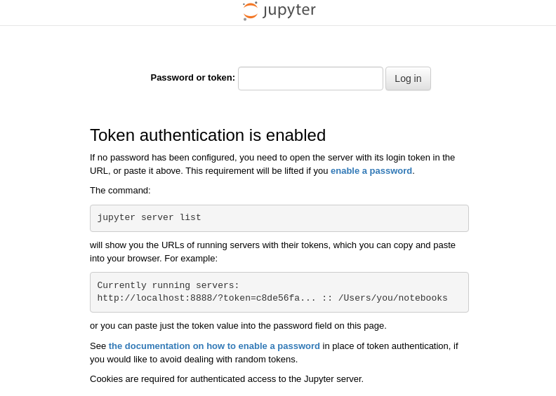

# blood_gastruloids

Files containing all the analysis of the single cell blood gastruloids.

# Folder structure

 - **assets**: Images for this README.md
 - **docker_run.sh**: Bash file that contains the code for launching the docker used for the analysis. More information below.
 - **setup.sh**: Bash file that runs all the steps required for preparing the folder to perform the analysis of the paper. It makes all the folders required, downloads the data from the corresponding pages etc...
 - **automatic_run.sh**: This bash file runs automatically all the code of the two analysis and the additional data. It has to be runned after `setup.sh` and in a terminal inside the docker image.
 - **Analysis_2021/**: Folder containing all the jupyter notebooks with the code of the analysis performed over the **first experiment** as well as the folders storing the plots, tables etc from running the code.
    - All the jupyter notebook in order of execution.
    - **setup_analysis.sh**: Bash file that generates all the folders storing the outcome of an analysis.
 - **Analysis_2022/**: Folder containing all the jupyter notebooks with the code of the analysis performed over the **second experiment** as well as the folders storing the plots, tables etc from running the code.
    - All the jupyter notebook in order of execution.
    - **setup_analysis.sh**: Bash file that generates all the folders storing the outcome of an analysis.
 - **Shared_data/**: Folder containing files that are used by different files in both analysis as relevant genes to plot, etc...
    - **Marker_genes_scRNAseq_Gx.csv**: File with a list of genes to plot.
 - **single_cell_tools**: copy of python library containing code that is used during the analysis.
 - **Data_other_studies**: Folder with the data used to compare our cells to other studies. Each subfolder contains an study, the bash file to download the data and a jupyter notebook to convert the raw data in our format.
    - **Fadlullah**: 
    - **Hadland**:
    - **Vink**:
    - **Plots**: Folder where the auxiliar plots from the other datasets are stored.
    - **Tables**: Folder where the auxiliar tables from the other datasets are stored.

# Using Docker

## Understanding the docker image

The analysis was performed in a docker container to be self-consistent among computers and users. We highly encourage that, if you want to reproduce the results of the analysis, you run the code in the environment.

For running the code you will need to have docker installed in your computer or a server. Alternatively, you can use other container based programs and convert the docker image to those.

The docker image basically starts an instance of jupyter lab. The docker already has installed python with all the packages necessary for the analysis. The bash `docker_run.sh` makes easier to run the docker.

```bash
#!/bin/bash

PATHIN="$(pwd)"                                                          #Get the absolute path of the terminal

CHANNEL=8888                                                             #Channel of the localhost where jupyter will be displayed
docker run \                                                             #Execute docker with:
           --rm \                                                        #Removing the docker image after finishing the analysis
           -p $CHANNEL:8888 \                                            #Redirecting the specified channel outside the docker
           --name blood_gastruloids \                                    #Name of the docker
           --mount type=bind,source=$PATHIN,destination=/home/jovyan \   #Mount the current folder inside the docker
           -e JUPYTER_ENABLE_LAB=yes \                                   #Execute juoyter lab intead of notebook
           dsblab/single_cell_analysis:0.5 \                             #Docker image to execute and version
```
## Execute the docker image 

In order to run the docker:
  1. Open a terminal in the main folder `blood gatruloids` and execute the `docker_run.sh` (you may need to give execution permissions).

```terminal
.../blood_gastruloids >>> ./docker_run.sh
```

 2. The docker image will download if you do not have it installed. After that, it will execute and you will see something like:

```terminal
.../blood_gastruloids >>> ./docker_run.sh
Executing the command: jupyter lab
[I 2022-08-23 12:19:46.611 ServerApp] jupyterlab | extension was successfully linked.
[W 2022-08-23 12:19:46.613 NotebookApp] 'ip' has moved from NotebookApp to ServerApp. This config will be passed to ServerApp. Be sure to update your config before our next release.
[W 2022-08-23 12:19:46.614 NotebookApp] 'port' has moved from NotebookApp to ServerApp. This config will be passed to ServerApp. Be sure to update your config before our next release.
[W 2022-08-23 12:19:46.614 NotebookApp] 'port' has moved from NotebookApp to ServerApp. This config will be passed to ServerApp. Be sure to update your config before our next release.
[I 2022-08-23 12:19:46.816 ServerApp] nbclassic | extension was successfully linked.
[I 2022-08-23 12:19:46.841 ServerApp] nbclassic | extension was successfully loaded.
[I 2022-08-23 12:19:46.842 LabApp] JupyterLab extension loaded from /opt/conda/lib/python3.9/site-packages/jupyterlab
[I 2022-08-23 12:19:46.842 LabApp] JupyterLab application directory is /opt/conda/share/jupyter/lab
[I 2022-08-23 12:19:46.845 ServerApp] jupyterlab | extension was successfully loaded.
[I 2022-08-23 12:19:46.845 ServerApp] Serving notebooks from local directory: /home/jovyan
[I 2022-08-23 12:19:46.845 ServerApp] Jupyter Server 1.11.1 is running at:
[I 2022-08-23 12:19:46.845 ServerApp] http://ac35f5219694:8888/lab?token=26a8513230eea22f3f4979fbcb3c6bd6c0eef818e52a4ede
[I 2022-08-23 12:19:46.845 ServerApp]  or http://127.0.0.1:8888/lab?token=26a8513230eea22f3f4979fbcb3c6bd6c0eef818e52a4ede
[I 2022-08-23 12:19:46.845 ServerApp] Use Control-C to stop this server and shut down all kernels (twice to skip confirmation).
[C 2022-08-23 12:19:46.848 ServerApp] 
    
    To access the server, open this file in a browser:
        file:///home/jovyan/.local/share/jupyter/runtime/jpserver-7-open.html
    Or copy and paste one of these URLs:
        http://ac35f5219694:8888/lab?token=26a8513230eea22f3f4979fbcb3c6bd6c0eef818e52a4ede
     or http://127.0.0.1:8888/lab?token=26a8513230eea22f3f4979fbcb3c6bd6c0eef818e52a4ede

```
Copy the token. In this case `token=26a8513230eea22f3f4979fbcb3c6bd6c0eef818e52a4ede`.

 3. Open a browser and browse localhost with the channel that you used to run the docker (8888 by default). 


 4. You should see a jupyter lab opening. Put the token in the box:



 5. You are inside the docker! 

## Troubleshooting

### Channel already been used

```terminal
.../blood_gastruloids >>> ./docker_run.sh
docker: Error response from daemon: driver failed programming external connectivity on endpoint blood_gastruloids (e2b08f04bbc32c4d6195e394813796678c29854b50cf09aab437d36da70767ad): Error starting userland proxy: listen tcp4 0.0.0.0:8888: bind: address already in use.
```

In case that the channel is being used, you should change to a different channelby modifying the variable `CHANNEL` in the bash file.
